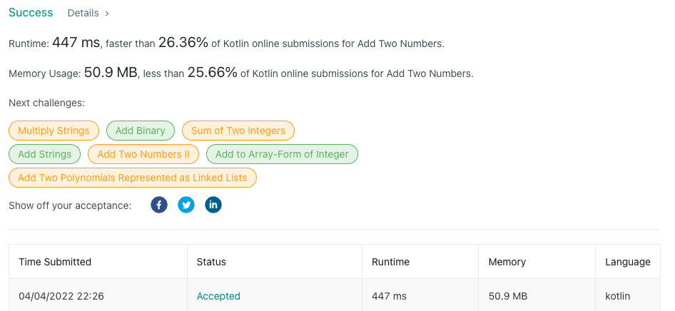

---

title: Leet Code AddTwoNumbers 
date: 2022-04-04
categories: [leet code]  
tags: ['kotlin', 'leet code']  

---

***
# 문제

You are given two **non-empty** linked lists representing two non-negative integers. The digits are stored in **reverse order**, and each of their nodes contains a single digit. Add the two numbers and return the sum as a linked list.

You may assume the two numbers do not contain any leading zero, except the number 0 itself.

**Example 1:**


```
Input: l1 = [2,4,3], l2 = [5,6,4]
Output: [7,0,8]
Explanation: 342 + 465 = 807.

```

**Example 2:**

```
Input: l1 = [0], l2 = [0]
Output: [0]

```

**Example 3:**

```
Input: l1 = [9,9,9,9,9,9,9], l2 = [9,9,9,9]
Output: [8,9,9,9,0,0,0,1]

```

**Constraints:**

- The number of nodes in each linked list is in the range `[1, 100]`.
- `0 <= Node.val <= 9`
- It is guaranteed that the list represents a number that does not have leading zeros.

# 코드

```java
/**
 * Example:
 * var li = ListNode(5)
 * var v = li.`val`
 * Definition for singly-linked list.
 * class ListNode(var `val`: Int) {
 *     var next: ListNode? = null
 * }
 */
class Solution {
    fun addTwoNumbers(l1: ListNode?, l2: ListNode?): ListNode? {
        var list1 = listNodeToList(l1)
        var list2 = listNodeToList(l2)
        var rNum = 0
        var list3: ArrayList<Int> = arrayListOf()

        if (list1.size <= list2.size) {
            (list1.indices).forEach { i ->
                list3.add(list1[i])
            }

            (list2.indices).forEach { i ->
                if (i < list3.size) {
                    val tmp = list3[i] + list2[i] + rNum

                    if (tmp > 9) {
                        list3[i] = tmp % 10
                        rNum = 1
                    } else {
                        list3[i] = tmp
                        rNum = 0
                    }
                } else {
                    val tmp = list2[i] + rNum

                    if (tmp > 9) {
                        list3.add(tmp % 10)
                        rNum = 1
                    } else {
                        list3.add(tmp)
                        rNum = 0
                    }
                }
            }

        } else {
            (list2.indices).forEach { i ->
                list3.add(list2[i])
            }

            (list1.indices).forEach { i ->
                if (i < list3.size) {
                    val tmp = list3[i] + list1[i] + rNum

                    if (tmp > 9) {
                        list3[i] = tmp % 10
                        rNum = 1
                    } else {
                        list3[i] = tmp
                        rNum = 0
                    }
                } else {
                    val tmp = list1[i] + rNum

                    rNum = if (tmp > 9) {
                        list3.add(tmp % 10)
                        1
                    } else {
                        list3.add(tmp)
                        0
                    }
                }
            }
        }

        if (rNum > 0) list3.add(rNum)

        return listToListNode(list3)
    }

    private fun listToListNode(list3: ArrayList<Int>): ListNode? {
        val result = ListNode(list3[0])
        var tmp = result

        for (i in 1 until list3.size) {
            tmp.next = ListNode(list3[i])
            val tmp2 = tmp.next

            if (tmp2 != null) {
                tmp = tmp2
            }
        }

        return result
    }

    private fun listNodeToList(li: ListNode?): List<Int> {
        var list: ArrayList<Int> = arrayListOf()
        var tmp: ListNode = li!!
        var flag = true

        do {
            list.add(tmp.`val`)

            val tmp2 = tmp.next
            if (tmp2 != null) {
                tmp = tmp2
            } else {
                flag = false
            }
        } while (flag)

        return list
    }
}
```

# 문제 해설
1. 제공되고 있는 ListNode 클래스의 구조는 다음과 같다
   ```java
   class ListNode(var `val`: Int) { 
       var next: ListNode? = null
   }
   ```
2. 링크드리스트 형태로 1번 노드에서 2번노드로 연결되는 형태로 구성되어 있다.
3. 주어진 `ListNode`의 값을 뒤집고 두 뒤집어진 값을 더해서 출력하는 것이 목표이다.
4. 뒤집어서 정수로 표현하기 위해 `Int`나 `List`와 같은 공간이 필요했고 가능한 쉽게 풀기위해 `List`에 값을 뒤집어서 저장했다.
5. 최대 `range`가 100이기 때문에 최대 반복은 100회가 된다. 시간복잡도는 통과된다.
6. 마지막으로 조건에서 0 처리만 잘 해준다면 문제가 없을 것으로 예상했고 통과했다.

# 결과


ps. 푸는데 걸린시간 1시간...

ps2. 코틀린 어렵다...
